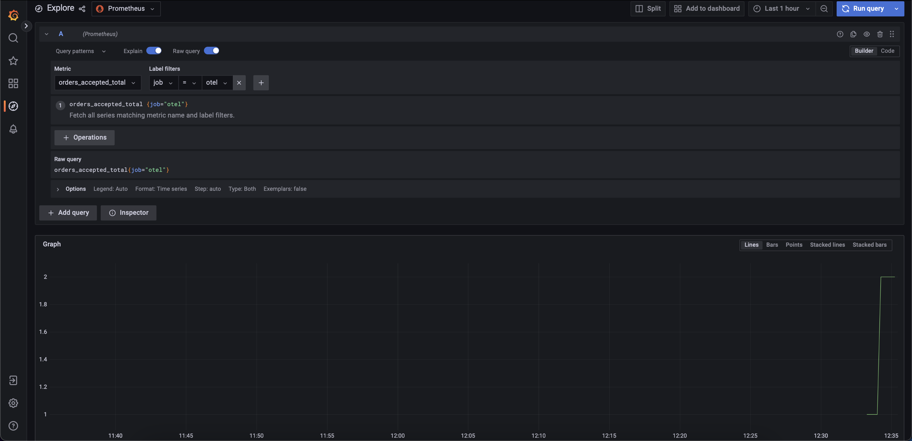
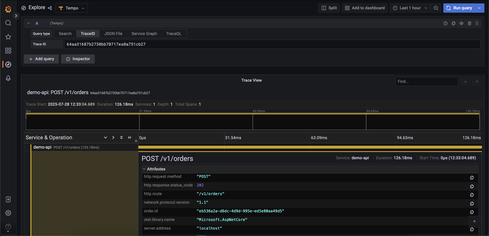
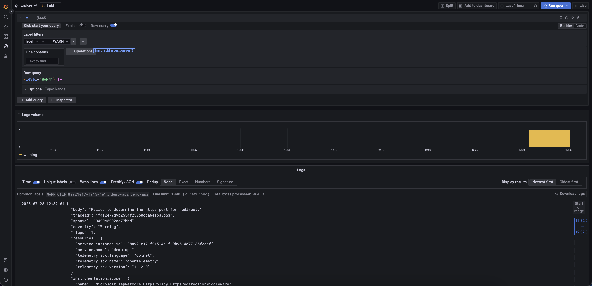

# OpenTelemetry Demo (.NET)

Hands-on demo project for .NET developers exploring [OpenTelemetry](https://opentelemetry.io/), presented during my lecture at **WTADS/WINFO**.

This project demonstrates how to collect and visualize **distributed traces**, **metrics**, and **logs** using .NET 8 and OpenTelemetry — integrated with **Grafana**, **Prometheus**, **Tempo**, and **Loki**.

---

## Stack

- .NET 8 – ASP.NET Core Web API
- OpenTelemetry – Tracing, Metrics, Logging
- Grafana – Unified Observability Dashboard
- Prometheus – Metrics backend
- Tempo – Trace backend
- Loki – Log backend
- Docker + Docker Compose – Environment orchestration

---

## How to Run Locally

### Prerequisites

- Docker & Docker Compose
- `make` installed

### Start the environment

```bash
make up
```

## Explore Observability with Grafana
After hitting some endpoints, visit Grafana at: http://localhost:3000

Use the preconfigured dashboards to explore:

## Metrics (via Prometheus)
<p align="center">  </p>

## Traces (via Tempo)
<p align="center">  </p>

## Logs (via Loki)
<p align="center">  </p>

## How to Stop and Clean Up

To stop all containers, remove volumes and orphans:
```
make down
```